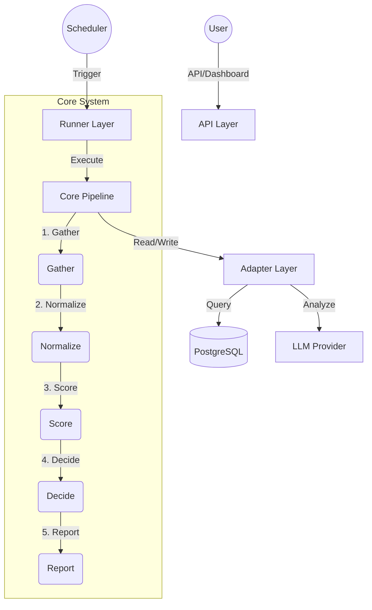

# DeepStock Research Engine

<div align="center">
  
  <br />
  <h3>Research-Only Stock Analysis Engine</h3>
  <p>브로커 주문 실행 없이 시그널 수집 · 점수화 · 판단 · 리포트 생성</p>

<p align="center">

</p>

  <a href="https://github.com/coreline-ai/stock_analysis_event/issues">
    
  </a>
  <a href="https://github.com/coreline-ai/stock_analysis_event/pulls">
    
  </a>
  <br />
  
  
  
  
</div>

<br />

## 📖 프로젝트 개요 (Overview)

**DeepStock**는 미국 및 한국 주식 시장의 데이터를 수집하고, 정량/이벤트/시장반응 신호를 분석하여 AI 기반의 투자 판단을 제공하는 **리서치 전용(Research-Only)** 시스템입니다.

실제 매매 주문을 실행하지 않으면서도, **"지금이 매수 타이밍인가?"**라는 질문에 대해 데이터와 논리에 기반한 답변을 제공합니다.

### 🌟 핵심 기능 (Key Features)

- **🛡️ Research-Only Safe Mode**: 실제 매매 기능이 완전히 제거된 안전한 분석 환경.
- **📡 Multi-Source Gathering**: Reddit, StockTwits, 뉴스, 공시(DART/SEC) 등 다양한 소스에서 시그널 수집.
- **🧠 AI-Driven Decisions**: GLM-4/GPT-4 등 LLM을 활용한 심층 분석 및 `BUY_NOW` / `WATCH` / `AVOID` 판단.
- **📊 Interactive Dashboard**: Next.js 기반 대시보드를 통해 실시간 분석 상태 및 리포트 시각화.
- **🔄 Automated Pipeline**: 수집부터 리포트 생성까지 5단계 파이프라인 자동화.

---

## 🏗️ 시스템 아키텍처 (Architecture)

시스템은 명확한 책임 분리를 위해 **4-Layer Architecture**를 따릅니다.



### 📂 프로젝트 구조 (Project Structure)

```text
/
├── app/                # Next.js App Router (Dashboard & API)
├── src/
│   ├── core/           # ★ Core Business Logic (Pipeline)
│   ├── adapters/       # Infrastructure Adapters (DB, LLM)
│   ├── config/         # Environment Configuration
│   └── security/       # Authentication & Rate Limiting
├── db/                 # Database Schema & Migrations
├── docs/               # Detailed Documentation (PRD, TRD)
└── scripts/            # Utility Scripts
```

---

## 🚀 시작하기 (Getting Started)

### 사전 요구사항 (Prerequisites)

- Node.js 20+
- PostgreSQL 16+ (또는 Docker)
- LLM API Key (GLM, OpenAI, 또는 Gemini)

### 설치 및 실행 (Installation)

1. **레포지토리 클론**
   ```bash
   git clone https://github.com/coreline-ai/stock_analysis_event.git
   cd stock_analysis_event
   ```

2. **의존성 설치**
   ```bash
   npm install
   ```

3. **환경 변수 설정**
   `.env.example` 파일을 복사하여 `.env` 파일을 생성하고 필수 값을 입력합니다.
   ```bash
   cp .env.example .env
   # .env 파일 편집: DATABASE_URL, LLM_PROVIDER, API 키 등 설정
   ```

4. **데이터베이스 설정**
   ```bash
   # Docker로 PostgreSQL 실행 (선택 사항)
   npm run db:up
   
   # 마이그레이션 적용
   npm run db:migrate
   ```

5. **개발 서버 실행**
   ```bash
   npm run dev
   ```
   - 대시보드 접근: `http://localhost:3000/dashboard`
   - 로컬 원샷 실행(권장): `npm run dev:local`  
     (DB 기동 + 마이그레이션 + 3333 포트 개발 서버)

---

## 🔍 프로젝트 상세 분석 (Code-Level)

> 분석 기준: `main` 브랜치 (2026-02-15 코드 스냅샷)

### 1) 실행 구조와 운영 모드

- **런타임**: Next.js App Router + Serverless API Route + PostgreSQL.
- **핵심 실행 진입점**:
  - `POST /api/agent/trigger`: 스코프 단위 수동 실행
  - `GET /api/agent/symbol-report?refresh=1`: 특정 종목 온디맨드 실행
- **Research-Only 강제**:
  - `ALPACA_API_KEY`, `ALPACA_API_SECRET`, `BROKER_MODE`, `TRADING_ENABLED` 존재 시 즉시 실패
  - 실제 주문 경로 없음
- **동시성 제어**:
  - DB 락(`pipeline_locks`) 기반 단일 실행 보장
  - 락 TTL 기본 10분, 토큰 일치 시에만 해제

### 2) 파이프라인 상세 (5단계 + 운영 제약)

| 단계 | 입력 | 출력 | 핵심 로직 |
|---|---|---|---|
| Gather | scope, limits | `SignalRaw[]` | US/KR 소스 병렬 수집 후 소스별 상한 적용 |
| Normalize | `SignalRaw[]` | `NormalizedSignal[]` | 티커 추출/정규화, 유효 심볼 필터링, `(raw_id,symbol)` 중복 제거 |
| Score | `NormalizedSignal[]` | `SignalScored[]` | 감성/신선도/소스 가중치 기반 점수 + KR 정량(거래량/수급/기술/이벤트) 하이브리드 보정 |
| Decide | `SignalScored[]` | `Decision[]` | LLM JSON 스키마 검증(최대 2회 재시도), 시장별 프롬프트 분기 |
| Report | `Decision[] + SignalScored[]` | `DailyReport` | verdict 섹션/근거/테마/리스크를 Markdown 리포트로 생성 |

**운영 제약(중요)**
- 실행 타임박스: `RUN_MAX_SECONDS` (+ 심볼 실행 시 `SYMBOL_RUN_MAX_SECONDS`)
- 최소 실행 간격: `MIN_SECONDS_BETWEEN_RUNS` (일부 엔드포인트는 `ignoreMinInterval=true`로 우회)
- 상태:
  - `success`: 전체 완료
  - `partial`: 락 미획득, 최소 간격 미충족, 타임박스 초과
  - `failed`: 그 외 오류

### 3) 시장별 수집 소스

- **US**: Reddit, StockTwits, SEC Edgar(8-K), News(NewsAPI/Google RSS fallback), Crypto(옵션)
- **KR**: Naver, DART, KR 커뮤니티, KR 뉴스, KR 리서치, KR 글로벌 컨텍스트
- 스코프는 `US | KR | ALL`, 전략키는 스코프와 1:1 매칭(`us_default`, `kr_default`, `all_default`)

### 4) 점수화/판단 로직 핵심

- `final_score`는 기본적으로 감성 × 신선도 × 소스가중치.
- KR 신호는 정량 점수(`quantScore`)와 안전 게이트(`hardFilterPassed`, `tripleCrownPassed`)를 함께 사용.
- LLM이 `BUY_NOW`를 반환해도 안전 기준 미충족이면 자동으로 `WATCH`로 하향 조정.
- 판단 결과는 `BUY_NOW | WATCH | AVOID` + 확신도 + 보유기간(`intraday/swing/long_term`)을 저장.

### 5) API 구성 요약

| Endpoint | Auth | 설명 |
|---|---|---|
| `GET /api/health` | No | 헬스체크 |
| `POST /api/agent/trigger` | Yes | 파이프라인 수동 실행 |
| `GET /api/agent/summary` | Yes | KPI/성공률/최근 실행 요약 |
| `GET /api/agent/status` | Yes | 실행 이력 페이징 조회 |
| `GET /api/agent/signals/raw` | Yes | Raw 시그널 조회 |
| `GET /api/agent/signals/scored` | Yes | 점수화 시그널 조회 |
| `GET /api/agent/decisions` | Yes | 판단 결과 조회 |
| `GET /api/agent/reports` | Yes | 일일 리포트 조회 |
| `GET /api/agent/symbol-report` | Yes | 종목 단위 리포트/온디맨드 실행 |
| `GET /api/agent/symbols/search` | Yes | KR/US 심볼 자동완성 |
| `GET /api/agent/symbols/resolve` | Yes | KR 코드 -> 종목명 매핑 |
| `GET /api/agent/quotes` | Yes | 현재가 조회(KR: Naver, US: Stooq) |
| `POST /api/agent/maintenance/rebuild-placeholders` | Yes | placeholder 정리/재생성 |
| `POST /api/telemetry/event` | No (Rate limit) | 대시보드 UX 이벤트 수집 |

간단 실행 예시:

```bash
curl -X POST "http://localhost:3000/api/agent/trigger" \
  -H "content-type: application/json" \
  -H "x-api-token: ${API_TOKEN}" \
  -d '{"marketScope":"KR","strategyKey":"kr_default","llmProvider":"glm"}'

curl "http://localhost:3000/api/agent/symbol-report?symbol=005930&scope=KR&refresh=1&llmProvider=glm" \
  -H "x-api-token: ${API_TOKEN}"
```

### 6) 데이터 모델 분석 (핵심 테이블)

| 테이블 | 역할 | 주요 관계 |
|---|---|---|
| `signals_raw` | 수집 원문 시그널 | `(source, external_id)` unique |
| `signals_scored` | 점수화 결과 | `raw_id -> signals_raw.id`, `run_ref` |
| `decisions` | LLM 판단 결과 | `sources_used`(scored id 배열), `run_ref` |
| `daily_reports` | 일일 리포트 | `(report_date, market_scope)` unique |
| `agent_runs` | 실행 이력/메트릭 | 스테이지 소요시간, 오류요약 |
| `kr_ticker_map` | KR 코드-종목명 캐시 | 심볼 리졸브/표시용 |
| `pipeline_locks` | 실행 락 관리 | 동시 실행 방지 |

### 7) 대시보드 화면 분석

- `/dashboard`: KPI, 성공률, 소스별 처리량, 단계별 소요 시간
- `/dashboard/signals`: raw/scored 신호 탐색 + 정량 시각화 차트
- `/dashboard/decisions`: verdict/리스크/트리거 중심 의사결정 뷰
- `/dashboard/reports`: 일일 리포트 목록/상세
- `/dashboard/runs`: 실행 로그/상태 추적
- `/dashboard/symbol-report`: 종목 단위 온디맨드 리포트 생성
- `/dashboard/settings`: 토큰/LLM/provider 설정 + 유지보수 작업

### 8) 품질 점검/운영 명령어

```bash
# 기본 검증
npm run lint
npm test

# 품질/진단
npm run diagnose:quality
npm run test:lock:e2e
npm run test:gui
npm run test:gui:features

# 운영
npm run maintenance:rebuild-placeholders
```

---

## 📚 문서 (Documentation)

더 자세한 내용은 `docs/` 디렉토리의 문서를 참고하세요.

- [**PRD.md**](docs/PRD.md): 제품 요구사항 정의서
- [**TRD.md**](docs/TRD.md): 기술 설계서
- [**PIPELINE_FLOW.md**](docs/PIPELINE_FLOW.md): 데이터 파이프라인 상세
- [**Conceptual Schema**](docs/conceptual_schema.md): 데이터 모델 설계
- [**API_GUI_CONTRACT.md**](docs/API_GUI_CONTRACT.md): API 응답 스키마/GUI 계약
- [**LOCKING.md**](docs/LOCKING.md): 파이프라인 락 동작 원리

---

## 🤝 기여 (Contributing)

이 프로젝트는 현재 비공개(Private)로 운영되지만, 내부 기여는 언제나 환영합니다.
Pull Request를 보내기 전에 `npm run lint`와 `npm test`를 실행하여 코드 품질을 확인해주세요.

## 📄 라이선스 (License)

This project is licensed under the **MIT License**.
